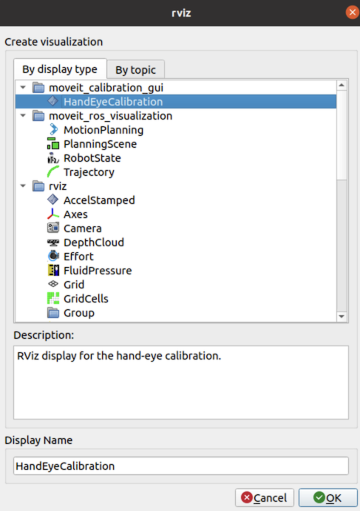
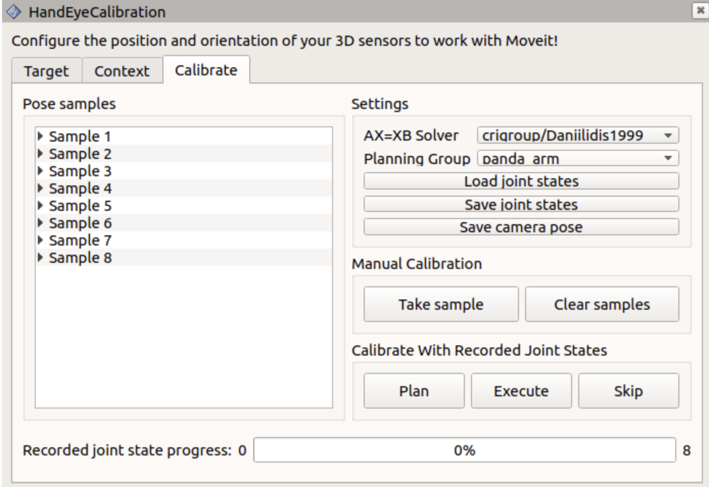

# Callibration
## Build Moveit Callibration Repository
Clone the Moveit_Callibration repository in the ```src``` folder in the workspace.
```
git clone git@github.com:ros-planning/moveit_calibration.git
```
### Install dependencies and build
```
rosdep install -y --from-paths . --ignore-src --rosdistro melodic
catkin_make
source devel/setup.sh
```
## Clone realsense plugin and set it on the UR5 arm
1. In the ```src``` folder clone the repository.
```
git clone git@github.com:IntelRealSense/realsense-ros.git
cd ..
catkin_make
source ./devel/setup.bash
```
2. Change the corresponding xacro file to insert the camera onto the robotic arm.
## Callibration using rviz
1. Launch the robot model on rviz
```
roslaunch ur5e_moveit_config demo.launch
```
2. Click the ```HandEyeCallibration``` panel in the display type after clicking "Add".

3. Create the AruCo Board as a Target and Print it
Click on the "Target" tab, and in the "Target Params" section enter the following details.

Select the "Image Topic" from the drop down menu as:
Select the "Camera Info Topic" from the drop down menu as:
Enter "Create Target", and then "Save Target". An Aruco board will be created, which could be printed on an A4 Sheet. 
4. Fill in the fields for the Geometric Context.
```change the below image later using the real one```

Place the printed AruCo board under the sensor of the UR5 arm. 
5. Collect Data samples for Callibration.
In the "Calibrate" tab, click "Take Sample", and the first Calibration sample is recorded. The progress bar named "Recorded Joint State progress" will show will show the number of joint states recorded. 

6. Finally click "Save camera pose" to export Callibration result.
